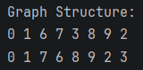
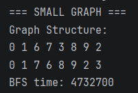
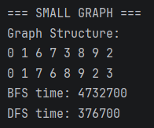
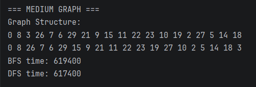
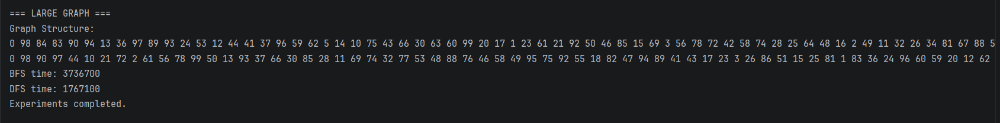

# Graph Traversal System (BFS & DFS)

---

## A. Project Overview

This project implements a graph using adjacency list representation.

A graph consists of:
- vertices (nodes)
- edges (connections between nodes)

The goal of this project is to implement and analyze two graph traversal algorithms:
- Breadth-First Search (BFS)
- Depth-First Search (DFS)

---

## B. Classes Description

### Vertex
Represents a node in the graph with a unique integer id.

### Edge
Represents a connection between two vertices (source → destination).

### Graph
Implements the graph using an adjacency list:
Map<Integer, List<Integer>>

Supports:
- addVertex()
- addEdge()
- bfs()
- dfs()

### Experiment
Runs experiments on graphs of different sizes:
- 10 vertices
- 30 vertices
- 100 vertices

Measures execution time using `System.nanoTime()`.

---

## C. Algorithm Descriptions

### BFS (Breadth-First Search)

Steps:
1. Start from the initial node
2. Add node to a queue
3. Mark node as visited
4. Visit all neighbors level by level

Use cases:
- shortest path in unweighted graphs
- level-order traversal

Time complexity: O(V + E)

---

### DFS (Depth-First Search)

Steps:
1. Start from a node
2. Visit it and mark as visited
3. Recursively visit unvisited neighbors
4. Backtrack when no more neighbors

Use cases:
- path finding
- cycle detection
- graph exploration

Time complexity: O(V + E)

---

## D. Experimental Results

Graphs tested:
- 10 vertices
- 30 vertices
- 100 vertices

| Graph Size | BFS Time (ns) | DFS Time (ns) |
|------------|---------------|---------------|
| 10         | 4732700       | 376700        |
| 30         | 619400        | 617400        |
| 100        | 3736700       | 1767100       |

### Observations:
- Execution time increases with graph size
- Both BFS and DFS have similar complexity O(V + E)
- DFS may sometimes be faster due to recursion efficiency
- Random graph structure affects traversal order

---

## E. Screenshots

### 1. Graph Structure (Adjacency List)
This shows how the graph is stored internally.

---

### 2. BFS Traversal (Small Graph)
Breadth-First Search traversal output.

---

### 3. DFS Traversal (Small Graph)
Depth-First Search traversal output.

---

### 4. Performance Results
Execution time comparison between BFS and DFS.

---

### 5. Large Graph Output
Traversal results for a larger graph.

---

## F. Reflection

This project helped me understand how graph traversal algorithms work in practice. BFS explores nodes level by level using a queue, while DFS explores deeper paths using recursion.

The main difference between them is the order of visiting nodes and their use cases. BFS is better for shortest path problems, while DFS is useful for deep exploration of graphs.

One of the challenges was implementing DFS recursion correctly and managing visited nodes to avoid повторных посещений. Another challenge was analyzing how graph size affects execution time and performance.

---

## Analysis Questions

### 1. How does graph size affect BFS and DFS performance?
As graph size increases, execution time increases because more vertices and edges must be processed.

---

### 2. Which traversal is faster in your experiments?
DFS is sometimes faster due to recursion efficiency, but both algorithms have similar performance overall.

---

### 3. Do results match O(V + E)?
Yes, both BFS and DFS visit each vertex and edge once, matching O(V + E) complexity.

---

### 4. How does graph structure affect traversal order?
Traversal order depends on how nodes are connected in the adjacency list. Different structures produce different outputs.

---

### 5. When is BFS preferred over DFS?
BFS is preferred when the shortest path or level-by-level traversal is required.

---

### 6. What are the limitations of DFS?
DFS may go too deep and use a lot of stack memory due to recursion. It is not optimal for shortest path problems.
